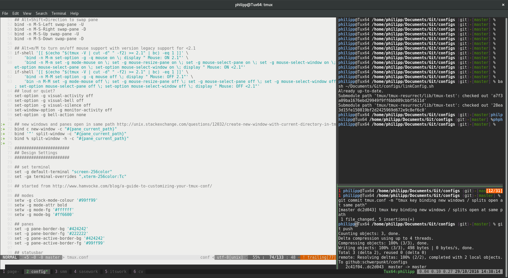

# configs

this is my config setup for
- tmux
- vim
- zsh (soon)
- ...

It is specifically designed to suit my personal workflow.
It is a composition of internet findings that work for me.

Screenshot of my setup:

